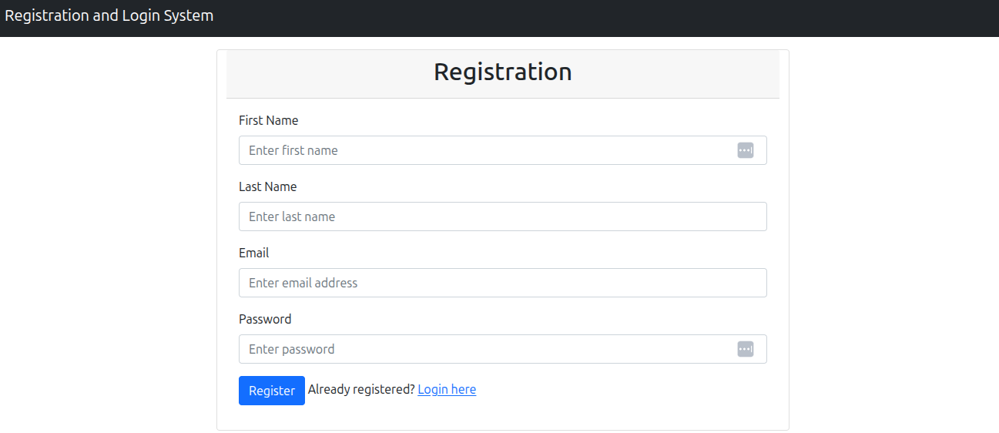
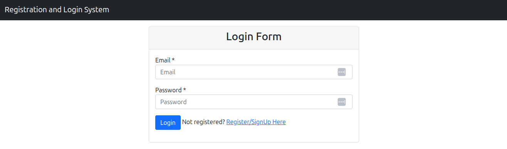
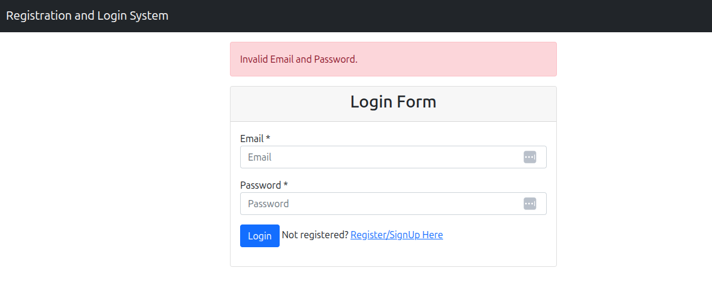
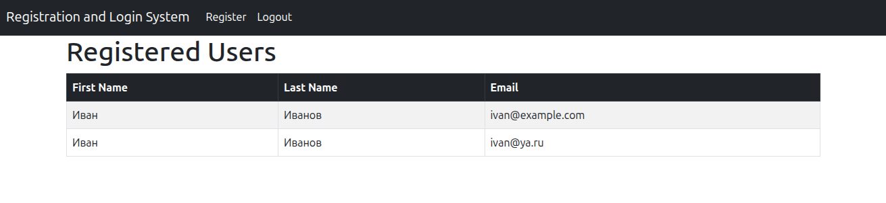

## Registration, Login with Spring MVC, MySql 

### Content:

[Requirements](#requirements)<br/>
[Maven wrapper setup](#maven_wrapper_setup)<br/>
[Config database](#config_database)<br/>
[Run](#run)<br/>
[Use](#use)<br/>
[Example Spring Boot 3 and Spring Security 8](#example_spring_boot_3)<br/>

<a id="requirements"></a>
### Requirements

Used Java 17, database MySql, name database __login_system__.

No unit tests.

Users/pass:

| User              | Password |
|-------------------|----------|
| ivan@example.com  | pass     |
| ivan@ya.ru        | pass     |

<a id="maven_wrapper_setup"></a>
### Setup Maven wrapper

Generate version 3.6.3:

````shell
export JAVA_HOME=/usr/lib/jvm/java-1.17.0-openjdk-amd64
mvn -N wrapper:wrapper -Dmaven=3.6.3
./mvnw clean package
````

<a id="config_database"></a>
### Config database

Set database in application.properties:

````yaml
spring.datasource.url=jdbc:mysql://v:3306/login_system
spring.datasource.username=vasi
spring.datasource.password=pass
````

<a id="run"></a>
### Run

[./run.sh](run.sh):

<a id="use"></a>
### Use

````shell
export JAVA_HOME=/usr/lib/jvm/java-1.17.0-openjdk-amd64
./mvnw clean spring-boot:run
````
Registration:


Login form:
[http://127.0.0.1:8080/login](http://127.0.0.1:8080/login)



Login error:
[http://127.0.0.1:8080/login?error](http://127.0.0.1:8080/login?error)



Show users if login OK:

[http://127.0.0.1:8080/users](http://127.0.0.1:8080/users)



<a id="example_spring_boot_3"></a>
### Example Spring Boot 3 and Spring Security 8

Registration-login-module using springboot, spring mvc, spring security and thymeleaf

http://www.javaguides.net/2018/10/user-registration-module-using-springboot-springmvc-springsecurity-hibernate5-thymeleaf-mysql.html
